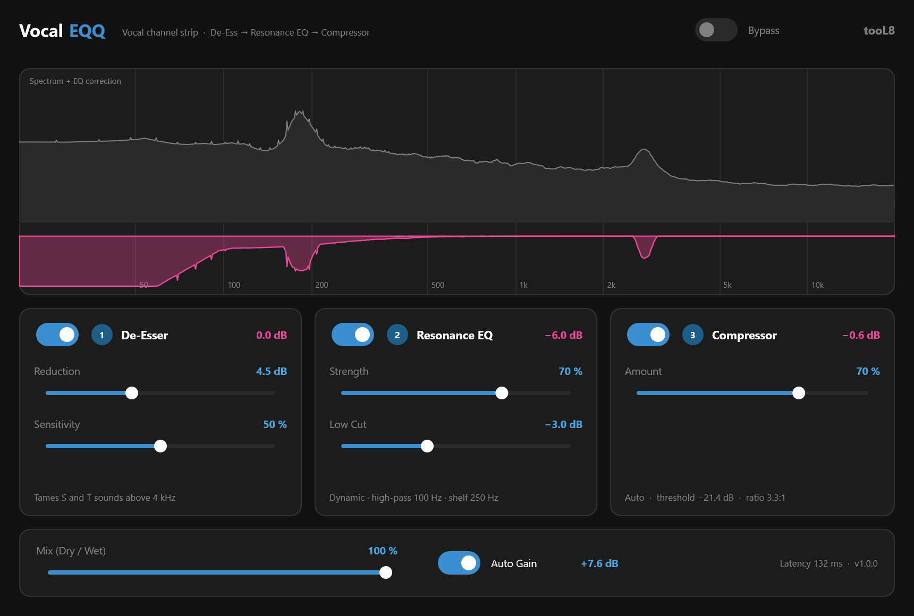

# Vocal EQQ

Channel-Strip für Gesang als VST3-Plugin und Standalone-App, gebaut mit
JUCE 8: **De-Esser → Resonanz-EQ → Kompressor** in einem Fenster, jede
Stufe mit einem oder zwei Reglern statt zwanzig. Die Kette stellt sich
selbst auf die Stimme ein — der EQ zähmt Resonanzen nur, wenn sie gerade
überschießen (Soothe-artig), der Kompressor leitet Schwelle und Ratio aus
der Dynamik der Aufnahme ab.

Hervorgegangen aus dem Python-Werkzeug `ai-vocal-eq` (privat, Schwester-
ordner). Die Signalverarbeitung ist von dort nach C++ portiert und an echten
Aufnahmen dagegen gemessen (siehe unten). Aufbau, Werkzeuge und Doku folgen
**Keyy** (`../Key`).



Einstieg für eine neue Arbeitssitzung: erst dieses README, dann
`CONTEXT.md` — dort stehen Zielsetzung, Entscheidungen und der offene Stand.

---

## Stand

| Baustein | Zustand |
|---|---|
| `DeEsser` (4 Merkmale, adaptive Schwellen, LR8-Weiche) | fertig, getestet, gegen Python gemessen |
| `ResonanceEq` (dynamisch, STFT-Overlap-Add, Hochpass + Shelf) | fertig, getestet, gegen Python gemessen |
| `AutoCompressor` (Perzentile laufend geschätzt, Soft-Knee) | fertig, getestet, gegen Python gemessen |
| `VocalChain` (Mix, Auto-Gain, Bypass, feste Latenz) | fertig, getestet |
| Offline-CLI `vocaleqq-cli` | fertig |
| Unit-Tests | 15 Testfälle, grün |
| VST3 + Standalone | baut unter Windows/MSVC ohne Warnung |
| Oberfläche im tooL8-Design | fertig, per Offscreen-Render geprüft (`vocaleqq-snapshot`) |
| **In FL Studio geprüft** | **noch nicht** |

---

## Bauen (Windows, Visual Studio)

Voraussetzung: Visual Studio (oder Build Tools) mit C++-Workload, CMake, Git.

```bat
cmake -B build
cmake --build build --config Release
```

Der erste Aufruf lädt JUCE 8.0.15 und Catch2 herunter. Wer Keyy oder Voxx
schon gebaut hat, spart sich den Download:

```bat
cmake -B build -DFETCHCONTENT_SOURCE_DIR_JUCE=../Voxx/build/_deps/juce-src -DFETCHCONTENT_SOURCE_DIR_CATCH2=../Voxx/build/_deps/catch2-src
```

Ergebnisse unter `build/VocalEQQ_artefacts/Release/`:

* `VST3/Vocal EQQ.vst3` — nach `C:\Program Files\Common Files\VST3`
  kopieren und in FL Studio unter *Options → Manage plugins* neu scannen
* `Standalone/Vocal EQQ.exe` — zum Testen ohne DAW

`-DVOCALEQQ_COPY_PLUGIN=ON` kopiert das VST3 automatisch, braucht dafür
aber Adminrechte. **Nur am DSP arbeiten** geht mit
`-DVOCALEQQ_BUILD_PLUGIN=OFF` ohne JUCE in Sekunden.

---

## Benutzen

Vocal EQQ als Effekt auf die Gesangsspur legen. Die Vorgaben sind die der
Python-Oberfläche und für die meisten Takes ein guter Start.

| Stufe | Regler | Was passiert |
|---|---|---|
| 1 De-Esser | Reduction, Sensitivity | Senkt das Band über 4 kHz ab, solange ein Zischlaut erkannt wird |
| 2 Resonance EQ | Strength, Low Cut | Senkt schmale Überhöhungen ab (150 Hz – 16 kHz, max. 6 dB), dazu Hochpass 100 Hz und weiches Shelf um 250 Hz |
| 3 Compressor | Amount | Schwelle und Ratio stellen sich selbst ein; die Fußzeile zeigt die aktuellen Werte |
| Kette | Mix, Auto Gain, Bypass | Auto Gain gleicht die Lautheit auf den Eingang an — der Vergleich mit Bypass ist damit fair |

Das Spektrum zeigt live den Eingang und in Pink, was der EQ gerade absenkt.

**Die Stufen lernen.** De-Esser und Kompressor schätzen ihre Schwellen aus
dem, was durchläuft. In den ersten Sekunden Gesang greifen sie deshalb
vorsichtiger; danach sitzen sie.

**Latenz 132 ms** bei 44,1 kHz, 122 ms bei 48 und 96 kHz. Die DAW gleicht das aus. Zum Einsingen mit Mithören taugt
das Plugin deshalb nicht — es ist für die Mischung gedacht.

---

## Selbst prüfen

### 1. Unit-Tests

```bat
cmake -B build-dsp -DVOCALEQQ_BUILD_PLUGIN=OFF
cmake --build build-dsp --config Release
build-dsp\Release\vocaleqq-tests
```

Geprüft wird unter anderem: dass der EQ ausgeschaltet exakt den verzögerten
Eingang liefert (auch in Stereo), dass Hochpass und Shelf die Werte des
Vorbilds treffen, dass eine Resonanz abgesenkt wird und ihr Umfeld kaum,
dass der De-Esser Zischlaute absenkt und dazwischen nichts anfasst, dass der
Kompressor den Abstand laut/leise verringert, dass nass und trocken
phasengleich sind (der Mix kämmt nicht), dass das Ergebnis nicht von der
Blockgröße abhängt und Auto-Gain die Lautheit trifft.

### 2. Eine Datei offline

```bat
build-dsp\Release\vocaleqq-cli take.wav take_vocaleqq.wav
build-dsp\Release\vocaleqq-cli take.wav --no-comp --strength 1 --low-cut 5
```

Die Ausgabe liegt sample-genau auf dem Eingang (Latenz ausgeglichen).

### 3. Download-Paket bauen

```bat
powershell -ExecutionPolicy Bypass -File tools\package.ps1
```

Frischer Release-Bau in `build-release`, dann `dist\VocalEQQ-<Version>-win64.zip`
mit VST3, Standalone, englischer Anleitung (`packaging/README.txt`) und
Lizenz, dazu eine SHA256-Datei. Die Laufzeitbibliothek ist statisch
eingebunden: Plugin und App brauchen kein Visual-C++-Paket auf dem
Zielrechner.

### 4. Screenshot der Oberfläche

```bat
cmake -B build -DVOCALEQQ_BUILD_SNAPSHOT=ON
cmake --build build --config Release --target vocaleqq-snapshot
build\vocaleqq-snapshot_artefacts\Release\vocaleqq-snapshot docs\screenshot.png
```

---

## Vergleich mit dem Python-Vorbild

Gemessen 2026-09-26 an `Main_vocal.wav` und `Double_vocal.wav` (je 111 s,
eigene Aufnahmen) mit denselben Einstellungen, Stufe für Stufe:

| Stufe | Abweichung |
|---|---|
| Resonanz-EQ | Bandpegel auf 0,02 dB gleich, Pegelverlauf im Mittel 0,06 dB |
| De-Esser | Höhen über 4 kHz 3,7–3,9 statt 3,9–4,3 dB abgesenkt; Pegelverlauf 0,03 dB |
| Kompressor | mittlere Absenkung −2,95 statt −2,77 dB bzw. −2,55 statt −3,08 dB; je 10 ms im Mittel 0,8 bis 1,1 dB auseinander |

Der EQ ist dieselbe Rechnung, nur Rahmen für Rahmen statt über die ganze
Datei. De-Esser und Kompressor können das nicht sein: Python rechnet ihre
Schwellen als Perzentile über die ganze Datei, das Plugin kennt nur das
bisher Gehörte und schätzt sie laufend (`QuantileTracker`). Wie träge diese
Schätzung sein darf, ist am Kompressor gemessen (Kommentar in
`AutoCompressor.cpp`).

---

## Aufbau

```
VocalEQQ/
├── source/dsp/             Signalverarbeitung, reines C++17 ohne JUCE
│   ├── Fft.*                    Radix-2-FFT vorwärts und rückwärts
│   ├── Filters.h                Biquad, LR8-Weiche, Verzögerung, Quantil-Schätzer
│   ├── DeEsser.*                Stufe 1
│   ├── ResonanceEq.*            Stufe 2
│   ├── AutoCompressor.*         Stufe 3
│   └── VocalChain.*             Kette, trockener Zweig, Mix, Auto-Gain, Bypass
├── source/plugin/          JUCE-Anbindung und Oberfläche (tooL8-Design)
├── tools/                  Offline-CLI, WAV-Lesen/Schreiben, Screenshot-Werkzeug
├── tests/                  Catch2-Tests mit synthetischen Signalen
└── docs/                   Screenshot
```

## Lizenz

Vocal EQQ ist freie Software unter der **GNU Affero General Public License
v3** (siehe `LICENSE`), wie Keyy. Grund: Vocal EQQ nutzt JUCE 8 unter dessen
AGPLv3-Lizenz und wird als Binary öffentlich weitergegeben.

Fremdcode: JUCE (AGPLv3), Catch2 (BSL-1.0, nur Tests).

*Vocal EQQ is free software licensed under the GNU AGPLv3.*
